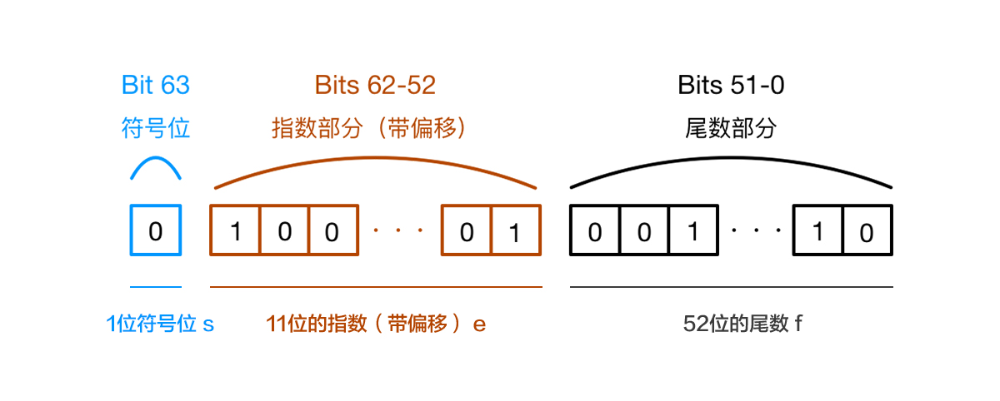

原文链接 http://www.css88.com/archives/7340#more-7340

## 问题描述
在JavaScrip中的整数和浮点数都属于`Number`数据类型，所有的数字都是以64位浮点数的形式存储的，即便整数也是如此，所以我们打印`1.00`这样的浮点数的结果是`1`而非`1.00`。在一些特殊的数值表示中，例如金额，这样看上去有点变扭，但至少是正确了。然而要命的是，当浮点数做数学运算的时候，你经常会发现一些问题，举几个例子：
```javascript
0.1 + 0.2 = 0.30000000000000004
0.3 - 0.2 = 0.09999999999999998
19.9 * 100 = 1989.9999999999998
0.3 / 0.1 = 2.9999999999999996
```

## 问题的原因
JavaScript里的数字采用[IEEE 754标准](https://zh.wikipedia.org/wiki/IEEE_754)的64位双精度浮点数，对于64位浮点数在内存中的表示，最高的1位是符号位，接着是11位是指数，剩下的52位为有效数字，具体：
- 第0位：符号位，s标识，0表示正数，1表示负数；
- 第1位到第11位：存储指数部分，e表示；
- 第12位到63位：储存小数部分（即有效数字），f表示
如图：

符号位决定了一个数的正负，指数部分决定了数值的大小，小数部分决定了数字的精度。IEEE 754规定，有效数字第一位默认总是1，不保存再64位浮点数数之中。也就是说，有效数字总是1.xx...xx的形式，其中xx..xx的部分保存在64位浮点数之中，最长可能为52位。因此，JavaScript提供的有效数字最长为53个二进制位（64位浮点的后52位+有效数字的第一位）。

### 计算过程
比如在JavaScript中计算`0.1+0.2`时，到底发生了什么呢？
首先，十进制的`0.1`和`0.2`都会被转换成二进制，但由于浮点数用二进制表达时时无穷的，例如：
```javascript
0.1 -> 0.0001100110011001... (无限)
0.2 -> 0.0011001100110011... (无限)
```
IEEE 754标准的64位双精度浮点数的小数部分最多支持53位二进制，所以两者相加之后得到二进制位：
```javascript
0.0100110011001100110011001100110011001100110011001100
```
因浮点数小数位的限制而截断的二进制数字，再转换为十进制，就成了`0.30000000000000004`。所以在进行算术计算时会产生误差。

### 整数精度问题
在JavaScript中，整数精度同样存在的问题，先来看看问题：
```javascript
console.log(19571992547450991); //=> 19571992547450990
console.log(19571992547450991===19571992547450992); //=> true
```
同样的原因，在JavaScript中`Number`类型统一按浮点数处理，整数是按最大54位来算最大(2^53-1，Number.MAX_SAFE_INTEGER，9007199254740991)和最小(-(2^53-1)，Number.MIN_SAFE_INTEGER,-9007199254740991)安全整数范围。所以只要超过了这个范围，就会存在被社区的精度问题。
 
当然这个问题并不只是在JavaScript中才会出现，几乎所有的编程语言都采用了IEEE-745浮点数表示法，任何使用二进制浮点数的编程语言都会有这个问题，只不过在很多其他语言中已经封装好了方法来避免精度的问题，而JavaScript是一门弱类型的语言，从设计思想上就没有对浮点数有个严格的数据类型，所以精度误差的问题就显得格外突出。

## 解决方案

### 类库
通常这种对精度要求高的计算都应该交给后端去计算和存储，因为后端有成熟的库来解决这种计算问题。前端也有几个不错的库，而且如果前端能及时并准确计算出结果值并展示给用户，能提升不少用户体验

#### Math.js
Math.js 是专门为 JavaScript 和 Node.js 提供的一个广泛的数学库。它具有灵活的表达式解析器，支持符号计算，配有大量内置函数和常量，并提供集成解决方案来处理不同的数据类型。像数字，大数字(超出安全数的数字)，复数，分数，单位和矩阵。 功能强大，易于使用。

官网：[http://mathjs.org/](http://mathjs.org/)  
Github: [https://github.com/josdejong/mathjs](https://github.com/josdejong/mathjs)

#### decimal.js
为JavaScript 提供十进制类型的任意精度数值。

官网：[http://mikemcl.github.io/decimal.js/](http://mikemcl.github.io/decimal.js/)  
GitHub：[https://github.com/MikeMcl/big.js/](https://github.com/MikeMcl/big.js/)

#### number-precision
一个小型的JavaScript，专门为了处理高精度浮点数的加减乘除

Github：[https://github.com/nefe/number-precision](https://github.com/nefe/number-precision)  

### 整数
把所有小数转化成小数进行计算，再转化成小数（其实这也是number-precision库的核心思路）
